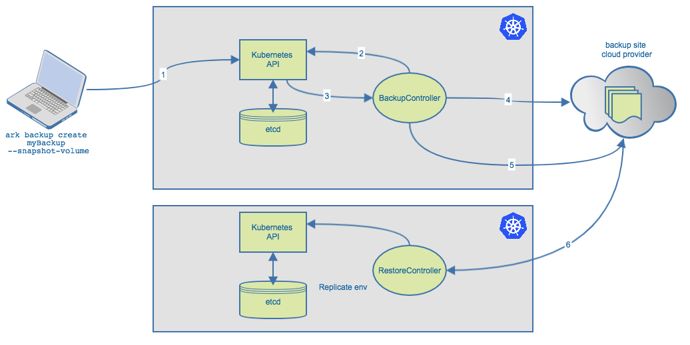

## Heptio Ark

### Overview
Ark is a utility for managing disaster recovery, specifically for your Kubernetes cluster 
resources and persistent volumes. It provides a simple and configurable services and tools to 
back up and restore applications and PVs from a defined set of snapshots or series of 
checkpoints. This allows means to automate the following scenarios:

* Disaster recovery with reduced TTR (time to respond), in the case of:
  * Infrastructure loss
  * Data corruption
  * Service outages
* Cross location/datacenter/cloud migration for Kubernetes API objects
* Development and testing environment setup (+ CI), via replication of a production environment

More concretely, Heptio Ark combines an in-Kubernetes-cluster service with a CLI that 
creates snapshots of:

* Configurable subsets of Kubernetes API objects (i.e. Pods/Apps) -- as tarballs stored 
in object storage
* Persistent Volumes

Ark storage currently supports AWS, GCP, and Azure cloud provider platforms.

### Kubernetes

Ark utilizes the ability to extend Kubernetes APIs by means of Custom Resource Definitions (CRD). 

A _resource_ is an endpoint in the Kubernetes API that stores a collection of API objects of a 
certain kind. For example, the built-in pods resource contains a collection of Pod objects.

A _custom resource_ is an extension of the Kubernetes API that is not necessarily available 
on every Kubernetes cluster. In other words, it represents a customization of a particular 
Kubernetes installation.

Deploying a CRD into a cluster causes the Kubernetes API server to begin serving the specified 
custom resource.

This frees anyone from writing their own API server to handle the custom resources, 
and the generic nature of the implementation allows any Kubernetes operator, tool, or API consumer 
to take advantage of these custom resources as they would any other Kubernetes operation.

### Operation

Simply download the Heptio Ark repository from GitHub to a location that can operate kubectl. 

Get the Ark server started on the Kubernetes cluster by executing the downloaded manifests.

Verify the Ark deployments have been successfully created in the Heptio-Ark namespace.

Finally install the Ark client binary alongside kubectl. While all interactions can be run by 
standard Kubernetes commands, the Ark client provides convenient shortcuts for quick operation.

Run back up and restore commands - simply `ark backup create {name of backup} --selector app=myApp`

### Architecture

As mentioned before, Ark runs in two different components:

* **Ark client**: Allows you to query, create, and delete the Ark resources as desired.
* **Ark server**: Runs all of the Ark controllers. Each controller watches its respective custom 
resource for API operations, performs validation, and handles the majority of the cloud API 
logic (e.g. interfacing with object storage and persistent volumes).

Looking at a specific example--an ark backup create test-backup command triggers the 
following operations:

1. The ark client makes a call to the Kubernetes API server, creating a Backup custom resource (which is stored in etcd).
2. The BackupController sees that a new Backup has been created, and validates it.
3. Once validation passes, the BackupController begins the backup process. It collects data by querying the Kubernetes API Server for resources.
4. Once the data has been aggregated, the BackupController makes a call to the object storage service (e.g. Amazon S3) to upload the backup file.
5. By default, Ark also makes disk snapshots of any persistent volumes, using the appropriate cloud service API. (This can be disabled via the option --snapshot-volumes=false)
6. (optional) Restore to another cluster - creates full Replication of existing environment