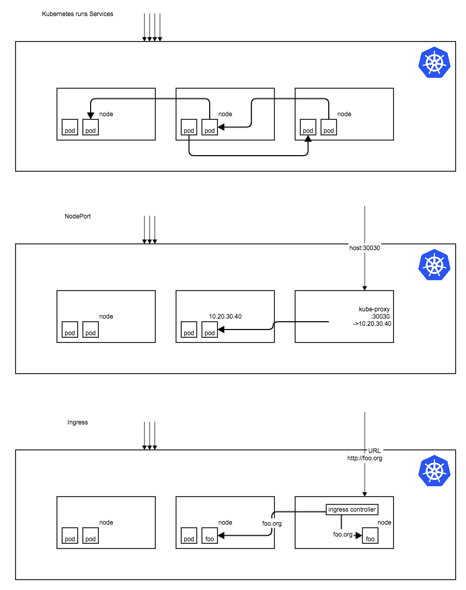

## Ingress

### Overview
Ingress is a means to manage external access to the services in a Kubernetes cluster, 
typically HTTP.

Ingress can provide load balancing, SSL termination and name-based virtual hosting.

An application deployed to a Kubernetes cluster is allocated to Kubernetes elements like Pods and
Services. 

Typically, Services and Pods have IPs only routable by the cluster network. 
All traffic that ends up at an edge router is either dropped or forwarded elsewhere.

(picture a wall between Internet and Services/Kube)

An Ingress is a collection of rules that allow inbound connections to reach the cluster services.

(picture a wall with passthru of Internet to Ingress to Services)

This allows internal applications and their services to have externally-reachable URLs, 
load balance traffic, terminate SSL, offer name based virtual hosting, and more. 

### Kubernetes

**Terminology**

* Node: A single virtual or physical machine in a Kubernetes cluster.
* Cluster: A group of nodes firewalled from the internet, that are the primary compute 
resources managed by Kubernetes.
* Edge router: A router that enforces the firewall policy for your cluster. 
This could be a gateway managed by a cloud provider or a physical piece of hardware.
* Cluster network: A set of links, logical or physical, that facilitate communication within 
a cluster according to the Kubernetes networking model. Examples of a Cluster network 
include Overlays such as flannel or SDNs such as OVS.
* Service: A Kubernetes Service that identifies a set of pods using label selectors. 
Unless mentioned otherwise, Services are assumed to have virtual IPs only routable 
within the cluster network.

Users request ingress by POSTing the Ingress resource to the API server. 
An Ingress controller is responsible for fulfilling the Ingress, usually with a loadbalancer, 
though it may also configure your edge router or additional frontends to help handle the traffic 
in an HA manner.

Ingress resources rely on a Ingress Controller running in the Kubernetes cluster. Ingress does not have
a default installed Controller. This needs to be added manually, as the Controller selected 
should be a best fit for your cluster. Multplie controllers can be ran if you want the ability
to seperate control over different types of traffic. These controllers don't neccessarily need to
be the same type either. GCE and NGINX are often referred to as different "classes" of Ingress controller.

An Ingress controllers job is to satisfy requests for Ingresses and handle any oddities within 
that particular class. It is described as a daemon, deployed as a Kubernetes Pod, that watches over the 
apiserver's `/ingresses` endpoint for updates to the Ingress resource.

### NGINX Controller
(NGINX DEPLOYMENT)
(NGINX CAPABILTIES)

### Operation

Manifest Sample
    
    code

### Architecture / Network

* Kubernetes runs Pods which implement Services 
* Pods need a Pod Network - routed or Overlay 
* Pod network is driven via CNI 
* Clients connect to Services via virtual Cluster IPs 
* Kubernetes has many ways to expose a Service outside the cluster 

#### Alternatives / Network by NodePort

